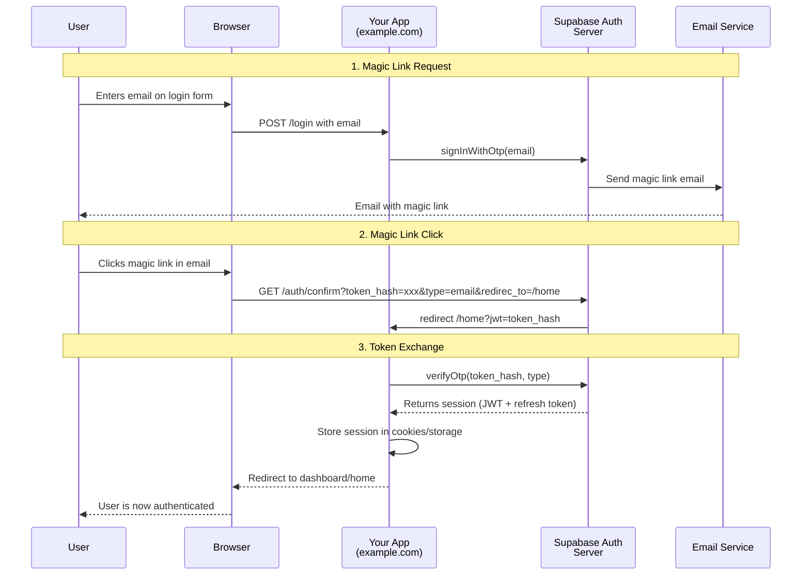
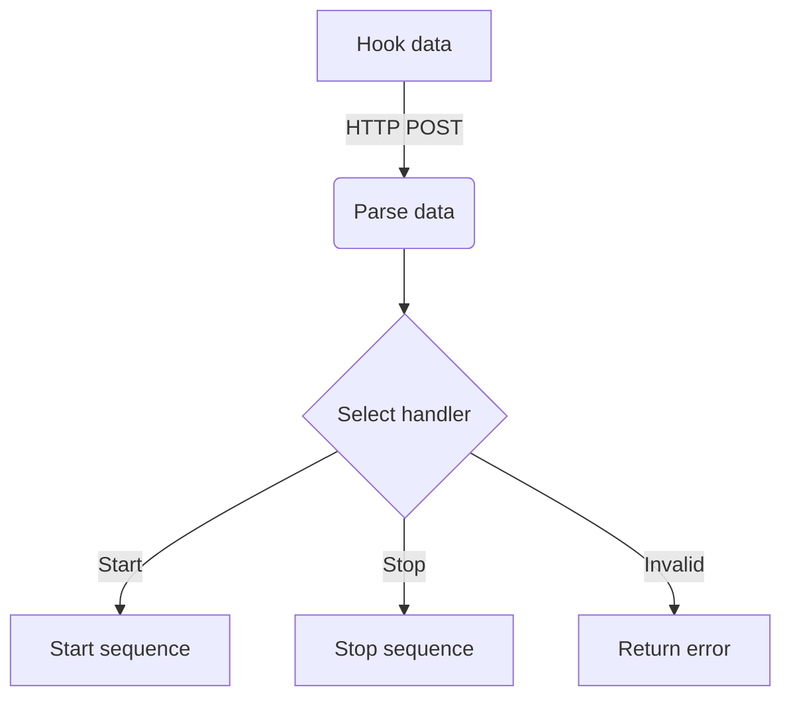

Start 3 background tasks to come up with architect designs for the GitHub/GitLab issue $ARGUMENTS. 
Evaluate the design of each architect, and create a single design presented to the user. 

Output 5 files:
- the three architect plans
- a document comparing the three plans and describing the reasoning for the final plan
- the final plan

Output all these files under `/issues/issue-<issue-number>` folder. 

## Task prompts

Each task should have the same prompt as follows:

<task prompt>
You are an experienced software architect tasked with breaking down the GitHub/GitLab issue $ARGUMENTS. into a detailed implementation plan. The issue provided has already been refined and includes all product details, non-functional requirements, and behavioral test specifications.

## Tasks

Create a comprehensive delivery plan that includes:

1. **New Components**
   - List all new methods with complete typed method signatures (parameters, return types)
   - List all new classes with their purpose and key properties
   - List all new variables/constants with their types and purposes
   - List all new database tables/columns if applicable

2. **Modified Components**
   - List all methods that need modification with:
      - Current signature
      - Proposed changes
      - Reason for modification
   - List all classes that need modification with:
      - Current state
      - Proposed changes
      - Impact analysis
   - List all variables/configurations that need updating

3. **UML Sequence Diagrams**
   - Create one or more Mermaid sequence diagram showing:
      - Data flow through the system
      - Event propagation
      - Method calls between components
      - External service interactions
      - Error handling flows
   - Include all methods and classes identified in sections 1 and 2

4. **UML Flow Diagrams**
   - Create one or more Mermaid activity/flow diagram showing:
      - Decision points in the system
      - Data routing logic
      - Process flows
      - Error handling paths
      - Integration points
   - Include all components identified in sections 1 and 2

5. **Testing Strategy**
   - Describe unit test requirements
   - Do not overcomplicate tests
   - Do not add excessive test cases

6. **Describe the planned architect**

   - Use clear markdown formatting with proper headings
   - Include code blocks for method signatures and UML diagrams
   - Add tables where appropriate for better organization

<architect-plan>
# Architect Plan for Issue $ARGUMENTS

## Context

[description of the issue needed to better understand the architecture]

## Planned code changes

### New resources

#### `src/api/v1/endpoints/hooks.py`

New hooks endpoint

Methods:

```python
@router.get("/health", response_model=HealthResponse)
async def health_check(db: Session = Depends(get_db))

def create_session_cookie(user_data: dict, response: Response) -> None:
```

Related tests go to:

- `tests/api/v1/endpoints/hooks.py`

Tests are needed for:

- expected data formats
- one erroneous data input
- timeout handling

#### `src/models/user_prompt.py`

[New resources detailed...]

#### `src/models/llm_output.py`

[New resources detailed...]

### Modified resources

#### `src/api/v1/api.py`

[Modifications detailed...]

#### `src/templates/home.py`

[Modifications detailed...]

## Data flow




</architect-plan>

## Rules

Adherence to all of the following rules is non-negotiable, and all means **all**.

- **Understand the scope:**
  The scope is clearly defined with all the requirements in issue $ARGUMENTS. Think hard to understand the scope of the work and where it should be implemented in the codebase.
- **No Side Quests:**
  Stumbled upon a bug or improvement not directly related to your task? Let the human know and decide what to do with it. Don't get distracted.
- **No Side Quests #2:**
  The requirements are defined in issue $ARGUMENTS. Do not add any more user-facing functionality or requirements! Keep the scope of the issue.
- **Follow existing patterns:**
  Do not add new directories if not strongly recommended. Do not add new files if the functionality has a decent place in an existing file.
- **Follow existing patterns #2:**
  Is every file a single class? Do files mostly contain functions, instead of classes? Follows the code organization seen across the files in a similar role to what you plan to add.
- **Follow the tasks and the rules:**
  Follow the tasks from above and these rules to fulfill the user's request

</task prompt>

## Process to follow

1. Start 3 background architect tasks using the provided prompt template
2. Wait for the three tasks to finish
3. Understand the 3 architect plans, and create a final recommendation
4. Write into the `/issues/issue-<issue-number>` folder:
   - the 3 architect plans
   - a document comparing the three plans and describing the reasoning for the final plan
   - the final plan
   
