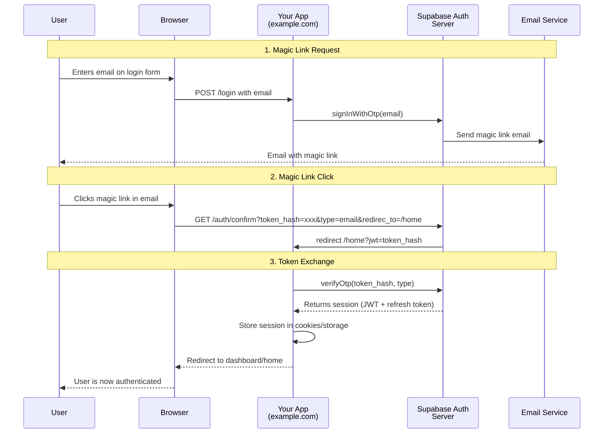
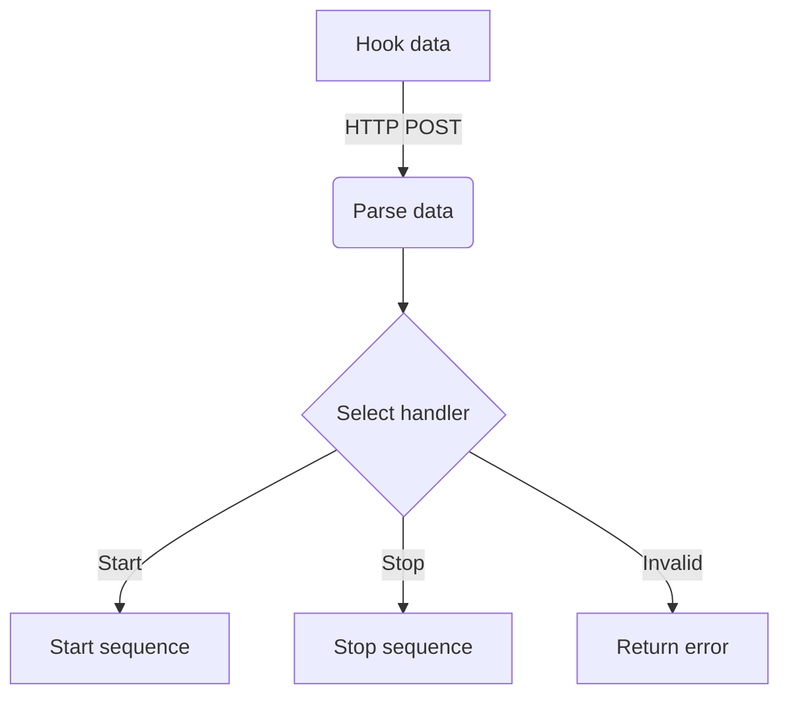

You are an experienced software architect tasked with breaking down the GitHub/GitLab issue $ARGUMENTS into a detailed implementation plan. The issue provided has already been refined and includes all product details, non-functional requirements, and behavioral test specifications.

Create a comprehensive delivery plan that includes:

1. **New Components**
   - List all new methods with complete typed method signatures (parameters, return types)
   - List all new classes with their purpose and key properties
   - List all new variables/constants with their types and purposes
   - List all new database tables/columns if applicable

2. **Modified Components**
   - List all methods that need modification with:
      - Current signature
      - Proposed changes
      - Reason for modification
   - List all classes that need modification with:
      - Current state
      - Proposed changes
      - Impact analysis
   - List all variables/configurations that need updating

3. **UML Sequence Diagrams**
   - Create one or more Mermaid sequence diagram showing:
      - Data flow through the system
      - Event propagation
      - Method calls between components
      - External service interactions
      - Error handling flows
   - Include all methods and classes identified in sections 1 and 2

4. **UML Flow Diagrams**
   - Create one or more Mermaid activity/flow diagram showing:
      - Decision points in the system
      - Data routing logic
      - Process flows
      - Error handling paths
      - Integration points
   - Include all components identified in sections 1 and 2

5. **Testing Strategy**
   - Describe unit test requirements
   - Do not overcomplicate tests
   - Do not add excessive test cases

6. **Describe the planned architect**

   - Create a markdown file at `./issues/issue-$ARGUMENTS/architect-plan.md`
   - Use clear markdown formatting with proper headings
   - Include code blocks for method signatures and UML diagrams
   - Add tables where appropriate for better organization

<architect-plan>
# Architect Plan for Issue #$ARGUMENTS

## Context

[description of the issue needed to better understand the architecture]

## Planned code changes

### New resources

#### `src/api/v1/endpoints/hooks.py`

New hooks endpoint

Methods:

```python
@router.get("/health", response_model=HealthResponse)
async def health_check(db: Session = Depends(get_db))

def create_session_cookie(user_data: dict, response: Response) -> None:
```

Related tests go to:

- `tests/api/v1/endpoints/hooks.py`

Tests are needed for:

- expected data formats
- one erroneous data input
- timeout handling

#### `src/models/user_prompt.py`

[New resources detailed...]

#### `src/models/llm_output.py`

[New resources detailed...]

### Modified resources

#### `src/api/v1/api.py`

[Modifications detailed...]

#### `src/templates/home.py`

[Modifications detailed...]

## Data flow




</architect-plan>

Issue to analyze: $ARGUMENTS

Steps:
1. Parse the issue to understand the requirements
2. Read @PROJECT_INFO.json to understand current architecture
3. Identify all components that need to be created or modified
4. Create the UML diagrams showing the complete solution
5. Define testing strategy
6. Output the complete plan to the specified markdown file

Remember to:
- Be specific about types, interfaces, and contracts
- Consider error handling and edge cases
- Think about scalability and maintainability
- Identify integration points with existing code
- Include logging and monitoring requirements

IMPORTANT: The only output created should be `./issues/issue-$ARGUMENTS/architect-plan.md`. Do NOT write any other files!
